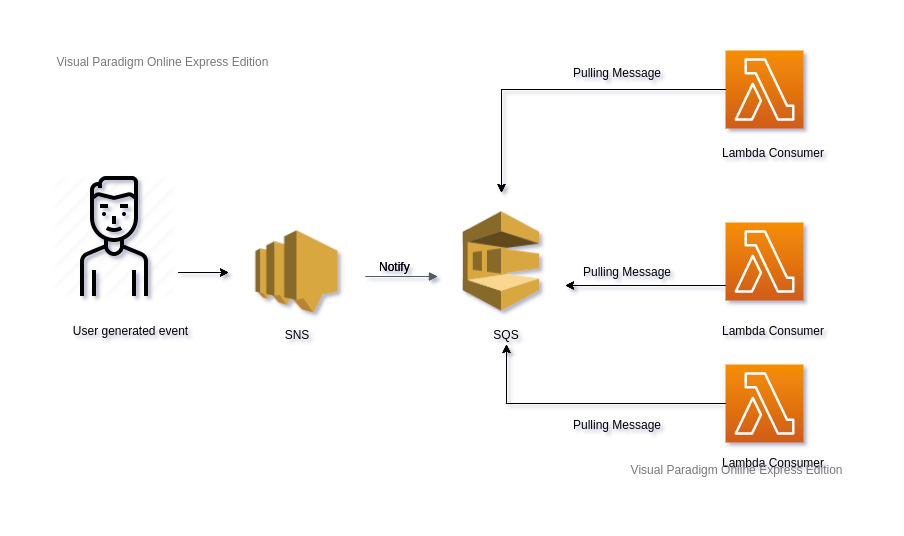

# ⚡ serverless-aws-fanout-example

Fanout pattern architecture

[](./architecture.png)


## Getting Started

See deployment for notes on how to deploy to AWS.

### Prerequisites

1. Make sure you're aws keys are set up in `~/.aws/credentials`
2. Make sure you have serveless installed.

```
npm install -g serverless
```

3. Also don't forget to:

```
npm install
```

## Deployment

In order to run create the stack in AWS run:

```
serverless deploy --region <region> --stage <stage>
```

## Tear down

To clean up run:


```
serverless remove
```


## Built With

* [Serverless](https://github.com/serverless/serverless) - The Serverless Framework
* [Webpack](https://github.com/webpack/webpack) - A bundler for javascript and friends

## Contributing

All contributions are welcome. Make a pull request wiihooo 🤠

## Authors

* **Gemini Wind**

## License

This project is licensed under the MIT License - see the [LICENSE.md](LICENSE.md) file for details
