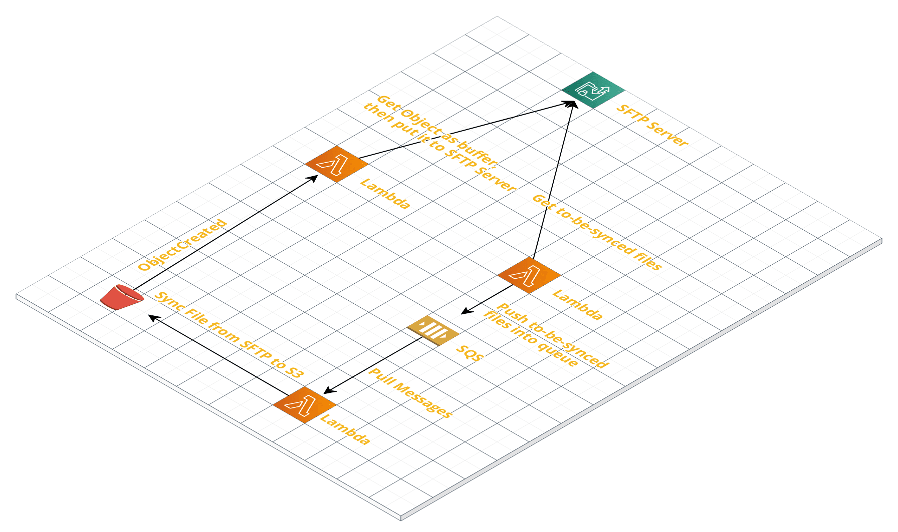

# ⚡ serverless-s3-sftp-sync

Sync folder and file between S3 and SFTP as the following mechanism:

- For S3 => SFTP: use S3 Put Event to trigger Lambda function. This function will get S3 object as readable stream, then put it to SFTP
- For SFTP => S3: use schedule trigger to get which files need to be synced to S3 from SFTP. After finding these files, their name will be put into SQS. There will be Lambda which will be triggered when new message is pushed into this SQS. Then, in these Lambda, they will be get file from SFTP as stream then put to S3.

By implementing mechanism, we can leverage of SQS + Lambda to handle in case that there are many file need to synced.

Architecture



## Getting Started

See deployment for notes on how to deploy to AWS.

### Prerequisites

1. Make sure you're aws keys are set up in `~/.aws/credentials`
2. Make sure you have serverless installed.

```
npm install -g serverless
```

3. Also don't forget to:

```
npm install
```

## Deployment

In order to run create the stack in AWS run:

```
export QUEUE_NAME = <your_distributed_queue_name>
export SFTP_HOST = <sftp_host>
export SFTP_USERNAME = <sftp_username>
export SFTP_PASSWORD = <sftp_password>
export SFTP_DIR = <sftp_dir>
export S3_SYNCED_BUCKET = <your_targeted_S3_bucket>

serverless deploy --region <region> --stage <stage>
```

**Note**: Your `S3_SYNCED_BUCKET` must be created before process deployment

## Tear down

To clean up run:


```
serverless remove
```


## Built With

* [Serverless](https://github.com/serverless/serverless) - The Serverless Framework
* [Webpack](https://github.com/webpack/webpack) - A bundler for javascript and friends

## Contributing

All contributions are welcome. Make a pull request wiihooo 🤠

## Authors

* **Gemini Wind**

## License

This project is licensed under the MIT License - see the [LICENSE.md](LICENSE.md) file for details
